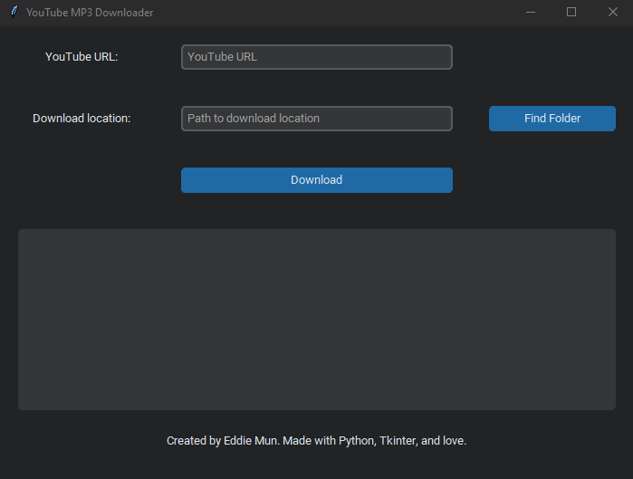

# YouMP3: YouTube to MP3 

A simple, clean, and effective open source desktop application to help you download .mp3 files for any video on YouTube. No need to use websites that constantly spam you with endless popup ads and viruses. 

Created with Python, Tkinter, and PyTube module by Eddie Mun.

Contact:
- LinkedIn: [https://www.linkedin.com/in/edward-mun/](https://www.linkedin.com/in/edward-mun/)
- Github: [https://github.com/eddiejmun](https://github.com/eddiejmun)

---

## Supported 
Currently the application is only supported for any OS that supports .exe files. 

Looking to also provide support for macOS for v2.

---
## Instructions

1. Paste a YouTube URL to the first input field 
2. Specify a local path to store the downloaded .mp3 file
    - NOTE: You can also open a folder viewer to specify the path using the 'Find Folder' button
3. Press the 'Download' button

